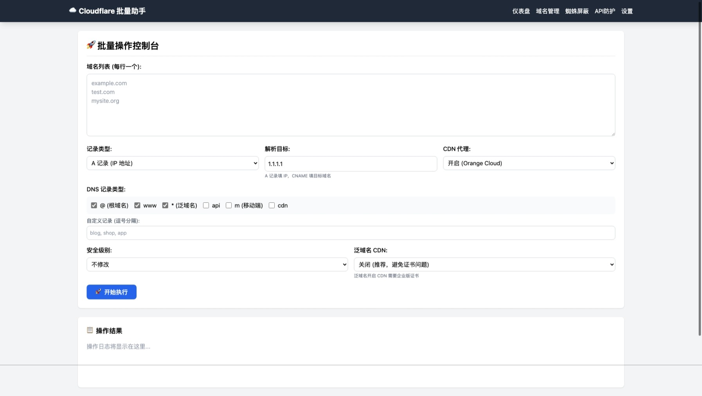
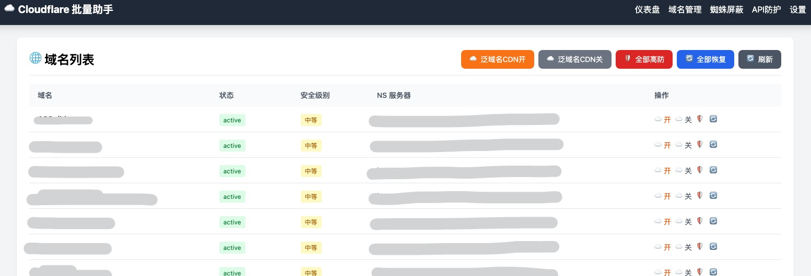
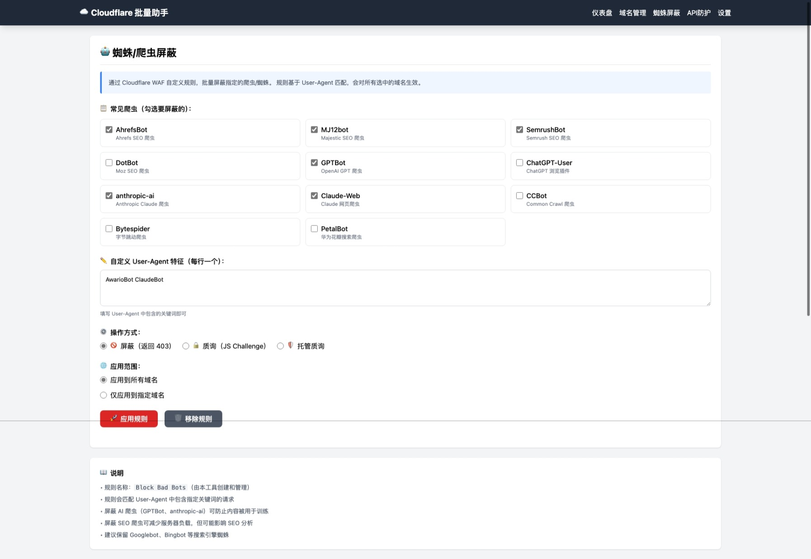
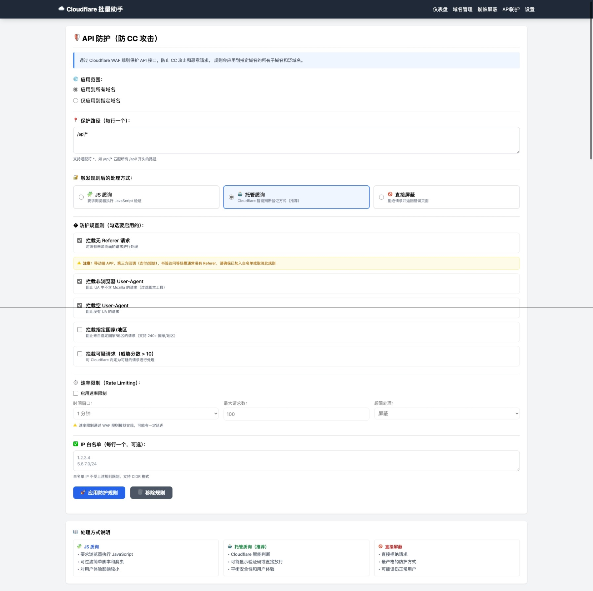
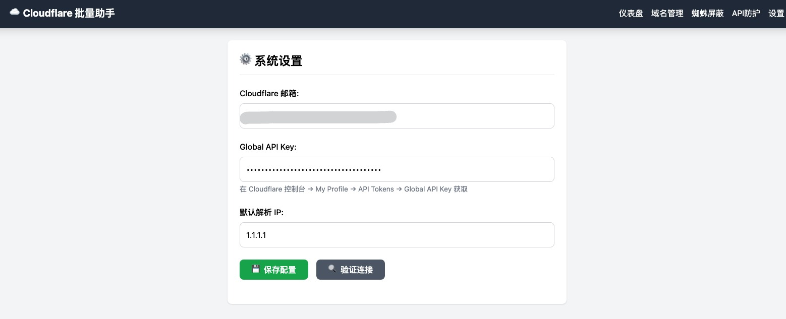

# Cloudflare 批量域名管理工具

基于 **Bun + Elysia + JSX (SSR) + HTMX** 构建的轻量级 Cloudflare 批量管理工具。

单文件打包，开箱即用，支持 macOS / Windows / Linux。

## 功能特性

- 🚀 **批量域名管理** - 一键添加多个域名，自动配置 DNS 记录
- 🌐 **域名列表** - 查看所有域名状态，批量设置安全级别和 CDN
- 🤖 **蜘蛛屏蔽** - 屏蔽恶意爬虫和 AI 爬虫
- 🛡️ **API 防护** - 防 CC 攻击，支持速率限制和国家屏蔽

## 截图预览

### 域名解析（批量添加）


### 域名列表


### 蜘蛛屏蔽


### API 防护


### 系统设置


## 快速开始

### 方式一：下载编译版本

从 [Releases](../../releases) 下载对应平台的可执行文件：

| 文件名 | 平台 |
|--------|------|
| cf-manager-mac | macOS Apple Silicon (M1/M2/M3) |
| cf-manager-mac-intel | macOS Intel |
| cf-manager.exe | Windows x64 |
| cf-manager-linux-x64 | Linux x64 |
| cf-manager-linux-arm64 | Linux ARM64 (RK3399/RK3588/树莓派等) |

桌面系统双击运行即可。

**服务器/NAS 远程运行：**

```bash
# 下载（以 ARM64 为例）
wget https://github.com/myfire2014/cf-manager/releases/latest/download/cf-manager-linux-arm64

# 添加执行权限
chmod +x cf-manager-linux-arm64

# 运行（--no-open 禁用自动打开浏览器）
./cf-manager-linux-arm64 --no-open

# 后台运行
nohup ./cf-manager-linux-arm64 --no-open > cf-manager.log 2>&1 &
```

然后通过 `http://服务器IP:3000` 访问。

### 方式二：从源码运行

```bash
# 安装依赖
bun install

# 开发模式（热重载）
bun run dev

# 生产模式
bun run start
```

启动后会自动打开浏览器，也可手动访问 http://localhost:3000

局域网内其他设备可通过 `http://你的IP:3000` 访问。

### 打包分发

```bash
# macOS (Apple Silicon)
bun run build:mac

# Windows
bun run build:win

# Linux
bun run build:linux
```

## 使用说明

### 1. 配置 API 凭证

首次使用需在「系统设置」页面配置：
- Cloudflare 账户邮箱
- Global API Key（在 [Cloudflare 控制台](https://dash.cloudflare.com/profile/api-tokens) → My Profile → API Tokens 获取）

### 2. 批量添加域名

1. 输入域名列表（每行一个或逗号分隔）
2. 选择记录类型（A 记录或 CNAME）
3. 填写解析目标（IP 或 CNAME 域名）
4. 选择 DNS 记录（@、www、*、自定义）
5. 设置 CDN 代理和安全级别
6. 点击「开始执行」

### 3. 蜘蛛屏蔽

- 预设常见爬虫：AhrefsBot、MJ12bot、SemrushBot 等
- AI 爬虫：GPTBot、anthropic-ai、Claude-Web
- 支持自定义 User-Agent 特征
- 三种处理方式：屏蔽、JS 质询、托管质询

### 4. API 防护

- 指定保护路径（支持通配符如 `/api/*`）
- 防护规则：屏蔽无 Referer、非浏览器 UA、空 UA、高风险国家
- 速率限制：可配置时间窗口和请求上限
- IP 白名单支持

## 技术栈

| 组件 | 说明 |
|------|------|
| [Bun](https://bun.sh) | 高性能 JavaScript 运行时 |
| [Elysia](https://elysiajs.com) | Bun 生态最快的 Web 框架 |
| [HTMX](https://htmx.org) | 无需前端 JS 的交互方案 |
| TailwindCSS | CDN 引入，零构建 |
| bun:sqlite | 内置 SQLite 存储配置 |

## 项目结构

```
├── src/
│   ├── components/        # UI 组件
│   ├── services/          # Cloudflare API 和数据存储
│   ├── views/             # 页面视图
│   └── index.tsx          # 程序入口
├── docs/                  # 截图文档
└── cf-manager.sqlite      # 配置数据（运行时生成）
```

## 注意事项

- 配置数据存储在 `cf-manager.sqlite` 文件中
- API 防护规则可能影响移动端 APP 或第三方回调，请配置白名单

## License

MIT
